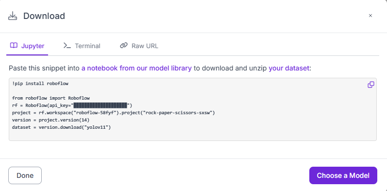
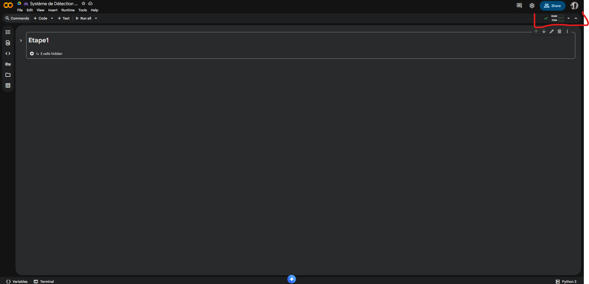
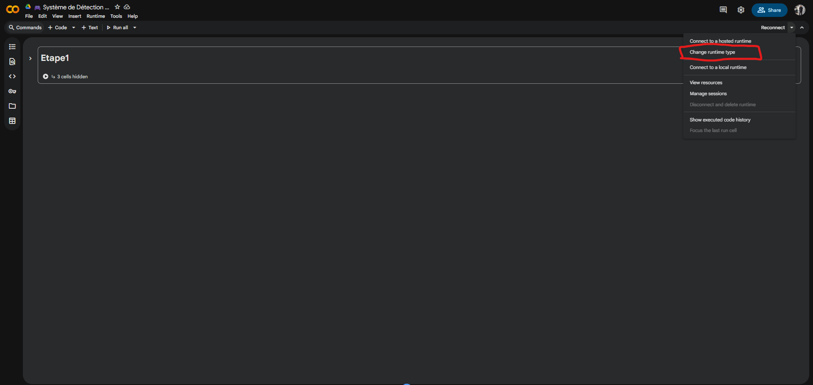
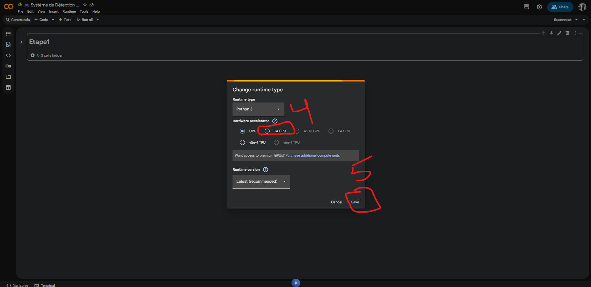
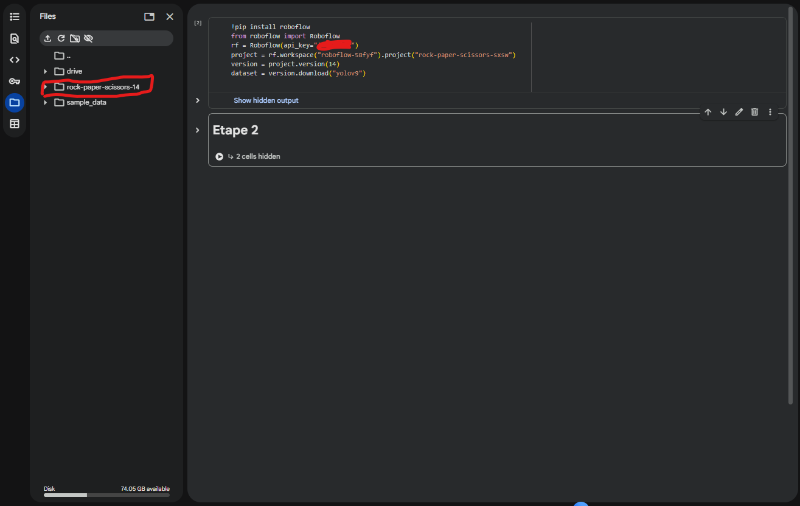
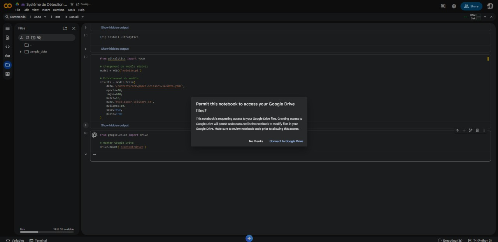
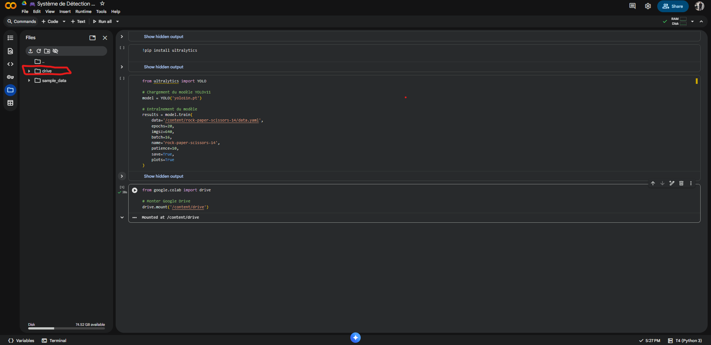

# 🎮 Système de Détection Pierre-Papier-Ciseaux avec YOLOv11


Projet de détection en temps réel des gestes Pierre, Papier, Ciseaux utilisant YOLOv11 et entraîné sur Google Colab.

---

## 📋 Table des matières
1. [Prérequis](#prérequis)
2. [Téléchargement du Dataset depuis Roboflow](#étape-1--téléchargement-du-dataset-depuis-roboflow)
3. [Entraînement du modèle sur Google Colab](#étape-2--entraînement-du-modèle-sur-google-colab)
4. [Configuration locale et installation](#étape-3--configuration-locale)
5. [Utilisation du système](#étape-4--utilisation-du-système)
6. [Structure du projet](#structure-du-projet)

---

## 🎯 Prérequis

- **Python 3.11** (recommandé)
- Compte **Roboflow** (gratuit)
- Compte **Google** (pour Google Colab)
- Webcam (pour la détection en temps réel)

---

## 📦 Étape 1 : Téléchargement du Dataset depuis Roboflow

### 1.1 Créer un compte Roboflow
1. Allez sur [Roboflow Universe](https://universe.roboflow.com/)
2. Créez un compte gratuit.
3. cherche sur le project [rock-paper-scissors Computer Vision Model](https://universe.roboflow.com/roboflow-58fyf/rock-paper-scissors-sxsw)
4. apres click sur [Dataset](https://universe.roboflow.com/roboflow-58fyf/rock-paper-scissors-sxsw/dataset/14) apres click sur [Download Dataset](https://universe.roboflow.com/roboflow-58fyf/rock-paper-scissors-sxsw/dataset/14/download) apres choisi 
 `Download dataset ` click  `continue ` apres choisi  `YOLOV11 `  pour `Image and Annotation Format ` et   `Show download code ` pour  `Download Options ` et click sur  `continuer `

<details>
<summary><b> Voir capture d'écran</b></summary>


</details>

### 1.2 Activer le GPU de Google Colab

1. Ouvrez [Google Colab](https://colab.research.google.com/)
2. Allez dans **Runtime** → **Change runtime type**
3. Sélectionnez **GPU** → **T4 GPU** (gratuit)
4. Cliquez sur **Save**

<details>
<summary><b> Voir toutes les captures d'écran</b></summary>





</details>

### 1.3 Vérifier le GPU

```python
# Vérifier que le GPU est activé
import torch
print(f"GPU disponible : {torch.cuda.is_available()}")
print(f"Nom du GPU : {torch.cuda.get_device_name(0)}")
```

**Sortie attendue** :
```
GPU disponible : True
Nom du GPU : Tesla T4
```

### 1.4 Télécharger le dataset
Dans **Google Colab**, exécutez :

```python
# Installation de Roboflow
!pip install roboflow

# Import et téléchargement du dataset
from roboflow import Roboflow

rf = Roboflow(api_key="api-key-personnel-doit-pas-partager")
project = rf.workspace("roboflow-58fyf").project("rock-paper-scissors-sxsw")
version = project.version(14)
dataset = version.download("yolov11")
```

**Résultat attendu** :
```
Collecting ultralytics
  Downloading ultralytics-8.3.235-py3-none-any.whl.metadata (37 kB)
Requirement already satisfied: numpy>=1.23.0 in /usr/local/lib/python3.12/dist-packages (from ultralytics) (2.0.2)
Requirement already satisfied: matplotlib>=3.3.0 in /usr/local/lib/python3.12/dist-packages (from ultralytics) (3.10.0)
Requirement already satisfied: opencv-python>=4.6.0 in /usr/local/lib/python3.12/dist-packages (from ultralytics) (4.12.0.88)
Requirement already satisfied: pillow>=7.1.2 in /usr/local/lib/python3.12/dist-packages (from ultralytics) (11.3.0)
Requirement already satisfied: pyyaml>=5.3.1 in /usr/local/lib/python3.12/dist-packages (from ultralytics) (6.0.3)
Requirement already satisfied: requests>=2.23.0 in /usr/local/lib/python3.12/dist-packages (from ultralytics) (2.32.4)
Requirement already satisfied: scipy>=1.4.1 in /usr/local/lib/python3.12/dist-packages (from ultralytics) (1.16.3)
Requirement already satisfied: torch>=1.8.0 in /usr/local/lib/python3.12/dist-packages (from ultralytics) (2.9.0+cu126)
Requirement already satisfied: torchvision>=0.9.0 in /usr/local/lib/python3.12/dist-packages (from ultralytics) (0.24.0+cu126)
Requirement already satisfied: psutil>=5.8.0 in /usr/local/lib/python3.12/dist-packages (from ultralytics) (5.9.5)
Requirement already satisfied: polars>=0.20.0 in /usr/local/lib/python3.12/dist-packages (from ultralytics) (1.31.0)
Collecting ultralytics-thop>=2.0.18 (from ultralytics)
  Downloading ultralytics_thop-2.0.18-py3-none-any.whl.metadata (14 kB)
Requirement already satisfied: contourpy>=1.0.1 in /usr/local/lib/python3.12/dist-packages (from matplotlib>=3.3.0->ultralytics) (1.3.3)
Requirement already satisfied: cycler>=0.10 in /usr/local/lib/python3.12/dist-packages (from matplotlib>=3.3.0->ultralytics) (0.12.1)
Requirement already satisfied: fonttools>=4.22.0 in /usr/local/lib/python3.12/dist-packages (from matplotlib>=3.3.0->ultralytics) (4.60.1)
Requirement already satisfied: kiwisolver>=1.3.1 in /usr/local/lib/python3.12/dist-packages (from matplotlib>=3.3.0->ultralytics) (1.4.9)
Requirement already satisfied: packaging>=20.0 in /usr/local/lib/python3.12/dist-packages (from matplotlib>=3.3.0->ultralytics) (25.0)
Requirement already satisfied: pyparsing>=2.3.1 in /usr/local/lib/python3.12/dist-packages (from matplotlib>=3.3.0->ultralytics) (3.2.5)
Requirement already satisfied: python-dateutil>=2.7 in /usr/local/lib/python3.12/dist-packages (from matplotlib>=3.3.0->ultralytics) (2.9.0.post0)
Requirement already satisfied: charset_normalizer<4,>=2 in /usr/local/lib/python3.12/dist-packages (from requests>=2.23.0->ultralytics) (3.4.4)
Requirement already satisfied: idna<4,>=2.5 in /usr/local/lib/python3.12/dist-packages (from requests>=2.23.0->ultralytics) (3.7)
Requirement already satisfied: urllib3<3,>=1.21.1 in /usr/local/lib/python3.12/dist-packages (from requests>=2.23.0->ultralytics) (2.5.0)
Requirement already satisfied: certifi>=2017.4.17 in /usr/local/lib/python3.12/dist-packages (from requests>=2.23.0->ultralytics) (2025.11.12)
Requirement already satisfied: filelock in /usr/local/lib/python3.12/dist-packages (from torch>=1.8.0->ultralytics) (3.20.0)
Requirement already satisfied: typing-extensions>=4.10.0 in /usr/local/lib/python3.12/dist-packages (from torch>=1.8.0->ultralytics) (4.15.0)
Requirement already satisfied: setuptools in /usr/local/lib/python3.12/dist-packages (from torch>=1.8.0->ultralytics) (75.2.0)
Requirement already satisfied: sympy>=1.13.3 in /usr/local/lib/python3.12/dist-packages (from torch>=1.8.0->ultralytics) (1.14.0)
Requirement already satisfied: networkx>=2.5.1 in /usr/local/lib/python3.12/dist-packages (from torch>=1.8.0->ultralytics) (3.6)
Requirement already satisfied: jinja2 in /usr/local/lib/python3.12/dist-packages (from torch>=1.8.0->ultralytics) (3.1.6)
Requirement already satisfied: fsspec>=0.8.5 in /usr/local/lib/python3.12/dist-packages (from torch>=1.8.0->ultralytics) (2025.3.0)
Requirement already satisfied: nvidia-cuda-nvrtc-cu12==12.6.77 in /usr/local/lib/python3.12/dist-packages (from torch>=1.8.0->ultralytics) (12.6.77)
Requirement already satisfied: nvidia-cuda-runtime-cu12==12.6.77 in /usr/local/lib/python3.12/dist-packages (from torch>=1.8.0->ultralytics) (12.6.77)
Requirement already satisfied: nvidia-cuda-cupti-cu12==12.6.80 in /usr/local/lib/python3.12/dist-packages (from torch>=1.8.0->ultralytics) (12.6.80)
Requirement already satisfied: nvidia-cudnn-cu12==9.10.2.21 in /usr/local/lib/python3.12/dist-packages (from torch>=1.8.0->ultralytics) (9.10.2.21)
Requirement already satisfied: nvidia-cublas-cu12==12.6.4.1 in /usr/local/lib/python3.12/dist-packages (from torch>=1.8.0->ultralytics) (12.6.4.1)
Requirement already satisfied: nvidia-cufft-cu12==11.3.0.4 in /usr/local/lib/python3.12/dist-packages (from torch>=1.8.0->ultralytics) (11.3.0.4)
Requirement already satisfied: nvidia-curand-cu12==10.3.7.77 in /usr/local/lib/python3.12/dist-packages (from torch>=1.8.0->ultralytics) (10.3.7.77)
Requirement already satisfied: nvidia-cusolver-cu12==11.7.1.2 in /usr/local/lib/python3.12/dist-packages (from torch>=1.8.0->ultralytics) (11.7.1.2)
Requirement already satisfied: nvidia-cusparse-cu12==12.5.4.2 in /usr/local/lib/python3.12/dist-packages (from torch>=1.8.0->ultralytics) (12.5.4.2)
Requirement already satisfied: nvidia-cusparselt-cu12==0.7.1 in /usr/local/lib/python3.12/dist-packages (from torch>=1.8.0->ultralytics) (0.7.1)
Requirement already satisfied: nvidia-nccl-cu12==2.27.5 in /usr/local/lib/python3.12/dist-packages (from torch>=1.8.0->ultralytics) (2.27.5)
Requirement already satisfied: nvidia-nvshmem-cu12==3.3.20 in /usr/local/lib/python3.12/dist-packages (from torch>=1.8.0->ultralytics) (3.3.20)
Requirement already satisfied: nvidia-nvtx-cu12==12.6.77 in /usr/local/lib/python3.12/dist-packages (from torch>=1.8.0->ultralytics) (12.6.77)
Requirement already satisfied: nvidia-nvjitlink-cu12==12.6.85 in /usr/local/lib/python3.12/dist-packages (from torch>=1.8.0->ultralytics) (12.6.85)
Requirement already satisfied: nvidia-cufile-cu12==1.11.1.6 in /usr/local/lib/python3.12/dist-packages (from torch>=1.8.0->ultralytics) (1.11.1.6)
Requirement already satisfied: triton==3.5.0 in /usr/local/lib/python3.12/dist-packages (from torch>=1.8.0->ultralytics) (3.5.0)
Requirement already satisfied: six>=1.5 in /usr/local/lib/python3.12/dist-packages (from python-dateutil>=2.7->matplotlib>=3.3.0->ultralytics) (1.17.0)
Requirement already satisfied: mpmath<1.4,>=1.1.0 in /usr/local/lib/python3.12/dist-packages (from sympy>=1.13.3->torch>=1.8.0->ultralytics) (1.3.0)
Requirement already satisfied: MarkupSafe>=2.0 in /usr/local/lib/python3.12/dist-packages (from jinja2->torch>=1.8.0->ultralytics) (3.0.3)
Downloading ultralytics-8.3.235-py3-none-any.whl (1.1 MB)
   ━━━━━━━━━━━━━━━━━━━━━━━━━━━━━━━━━━━━━━━━ 1.1/1.1 MB 27.3 MB/s eta 0:00:00
Downloading ultralytics_thop-2.0.18-py3-none-any.whl (28 kB)
Installing collected packages: ultralytics-thop, ultralytics
Successfully installed ultralytics-8.3.235 ultralytics-thop-2.0.18
```
<details>
<summary><b> Voir capture d'écran</b></summary>


</details>


---

## 🚀 Étape 2 : Entraînement du modèle sur Google Colab


### 2.1 Installer Ultralytics et entraîner le modèle

```python
# Installation d'Ultralytics
!pip install ultralytics

from ultralytics import YOLO

# Chargement du modèle YOLOv11 pré-entraîné (nano version - léger et rapide)
model = YOLO('yolo11n.pt')

# Entraînement du modèle sur notre dataset
results = model.train(
    data='/content/rock-paper-scissors-14/data.yaml',  # Chemin vers le fichier de configuration
    epochs=20,                    # Nombre d'epochs (cycles d'entraînement)
    imgsz=640,                    # Taille des images (640x640 pixels)
    batch=16,                     # Nombre d'images par batch
    name='rock-paper-scissors-14', # Nom du projet pour sauvegarder les résultats
    patience=10,                  # Early stopping : arrête si pas d'amélioration après 10 epochs
    save=True,                    # Sauvegarder le meilleur modèle
    plots=True                    # Générer des graphiques de performance
)
```

**📊 Explication des paramètres :**

| Paramètre | Valeur | Description |
|-----------|--------|-------------|
| **data** | `/content/rock-paper-scissors-14/data.yaml` | Fichier contenant les chemins du dataset et les classes |
| **epochs** | `20` | Nombre de fois que le modèle va voir tout le dataset (recommandé: 20-50) |
| **imgsz** | `640` | Dimensions des images d'entraînement en pixels (640x640) |
| **batch** | `16` | Nombre d'images traitées simultanément (ajustez selon la mémoire GPU) |
| **name** | `rock-paper-scissors-14` | Nom du dossier où seront sauvegardés les résultats |
| **patience** | `10` | Arrête l'entraînement si aucune amélioration après 10 epochs |
| **save** | `True` | Sauvegarde automatiquement le meilleur modèle (best.pt) |
| **plots** | `True` | Génère des graphiques de performance (loss, précision, recall) |

**⏱️ Durée estimée :** 10-15 minutes avec GPU T4

**💡 Astuce :** Si vous avez une erreur "Out of Memory", réduisez `batch` à `8` ou `imgsz` à `416`


**L'entraînement va durer environ 10-15 minutes.**


---

## 💾 Étape 3 : Sauvegarder le modèle sur Google Drive

### 3.1 Connecter Google Drive à Colab

```python
from google.colab import drive

# Monter Google Drive
drive.mount('/content/drive')
```

**Vous serez invité à autoriser l'accès** :
1. Connectez-vous avec votre compte Google


<details>
<summary><b> Voir capture d'écran</b></summary>



</details>


### 3.2 Copier les fichiers vers Google Drive

```python
import shutil

# Créer un dossier sur Google Drive
!mkdir -p /content/drive/MyDrive/RPS_Model

# Copier le modèle entraîné (best.pt)
shutil.copy('/content/runs/detect/rock-paper-scissors-14/weights/best.pt', 
            '/content/drive/MyDrive/RPS_Model/best.pt')

# Copier le fichier data.yaml
shutil.copy('/content/rock-paper-scissors-14/data.yaml', 
            '/content/drive/MyDrive/RPS_Model/data.yaml')

# Copier tous les résultats d'entraînement
shutil.copytree('/content/runs/detect/rock-paper-scissors-14', 
                '/content/drive/MyDrive/RPS_Model/training_results', 
                dirs_exist_ok=True)

print("✅ Fichiers copiés avec succès sur Google Drive!")
```


### 3.3 Télécharger les fichiers essentiels

Vous pouvez aussi télécharger directement :

```python
from google.colab import files

# Télécharger best.pt
files.download('/content/runs/detect/rock-paper-scissors-14/weights/best.pt')

# Télécharger data.yaml
files.download('/content/rock-paper-scissors-14/data.yaml')
```

---

## 🖥️ Étape 4 : Configuration locale

### 4.1 Récupérer les fichiers depuis Google Drive

1. Allez sur [Google Drive](https://drive.google.com/)
2. Naviguez vers **MyDrive** → **RPS_Model**
3. Téléchargez `best.pt` et `data.yaml`


### 4.2 Cloner le projet GitHub

```bash
git clone https://github.com/VOTRE_USERNAME/rock-paper-scissors-yolo.git
cd rock-paper-scissors-yolo
```

### 4.3 Créer un environnement virtuel

**Windows** :
```bash
python -m venv .venv
.venv\Scripts\activate
```

**macOS/Linux** :
```bash
python3 -m venv .venv
source .venv/bin/activate
```

### 4.4 Installer les dépendances

```bash
# Installer les bibliothèques nécessaires
pip install ultralytics==8.3.0
pip install opencv-contrib-python==4.10.0.84
pip install matplotlib==3.9.2
pip install pyyaml==6.0.2
pip install pillow==10.4.0
pip install torch torchvision
```

**OU utilisez le fichier `requirements.txt`** :

```bash
pip install -r requirements.txt
```

## 🎯 Étape 5 : Placer les fichiers du modèle

### 5.1 Structure du projet

```
papier/
│
├── rps_detector.py          # Script principal
├── best.pt                  # Modèle entraîné (à placer ici)
├── data.yaml                # Configuration du dataset (à placer ici)
├── requirements.txt         # Dépendances Python
├── README.md                # Ce fichier
│

```


## 🏃 Étape 6 : Exécution du système

### 6.1 Lancer le programme

```bash
python rps_detector.py
```

### 6.2 Options disponibles

```
✊✋✌️  SYSTÈME DE DÉTECTION PIERRE-PAPIER-CISEAUX ✊✋✌️
============================================================

📋 OPTIONS DISPONIBLES:

  1️⃣  - Détecter sur une image
  2️⃣  - Détecter sur un dossier d'images
  3️⃣  - Détecter depuis une URL
  4️⃣  - Détecter sur une vidéo
  5️⃣  - Détection personnalisée (seuils ajustables)
  6️⃣  - Détection webcam en temps réel
  7️⃣  - Détecter sur le dossier test complet
  8️⃣  - 🎮 MODE JEU: Jouer contre l'ordinateur!
  0️⃣  - Quitter le programme
```


## 🛠️ Dépannage

### Erreur : "No module named 'ultralytics'"
```bash
pip install ultralytics
```

### Erreur : "OpenCV not found"
```bash
pip install opencv-contrib-python
```

### Erreur : "Webcam not detected"
- Vérifiez que votre webcam est connectée
- Essayez de changer `cv2.VideoCapture(0)` en `cv2.VideoCapture(1)`

### Erreur : "CUDA out of memory" (sur Colab)
- Réduisez le `batch` à 8 au lieu de 16
- Réduisez `imgsz` à 416 au lieu de 640

---

## 📝 Fichier requirements.txt

Créez un fichier `requirements.txt` :

```txt
ultralytics==8.3.0
opencv-contrib-python==4.10.0.84
matplotlib==3.9.2
pyyaml==6.0.2
pillow==10.4.0
torch>=2.0.0
torchvision>=0.15.0
```

---

## 🎓 Ressources supplémentaires

- [Documentation YOLOv11](https://docs.ultralytics.com/)
- [Roboflow Universe](https://universe.roboflow.com/)
- [Google Colab](https://colab.research.google.com/)
- [OpenCV Documentation](https://docs.opencv.org/)

---

## 👨‍💻 Auteur

**Votre Nom**
- GitHub: [@Armoumad](https://github.com/Armoumad)
- Email: abdelghafourmoumad@gmail.com

---


## 🤝 Contribution

Les contributions sont les bienvenues ! N'hésitez pas à :
1. Fork le projet
2. Créer une branche (`git checkout -b feature/amelioration`)
3. Commit vos changements (`git commit -m 'Ajout fonctionnalité'`)
4. Push vers la branche (`git push origin feature/amelioration`)
5. Ouvrir une Pull Request

---

## ⭐ Remerciements

- Dataset fourni par [Roboflow Universe](https://universe.roboflow.com/roboflow-58fyf/rock-paper-scissors-sxsw)
- YOLOv11 par [Ultralytics](https://github.com/ultralytics/ultralytics)
- Google Colab pour les ressources GPU gratuites

---

**Bon entraînement et amusez-vous bien ! 🚀**


